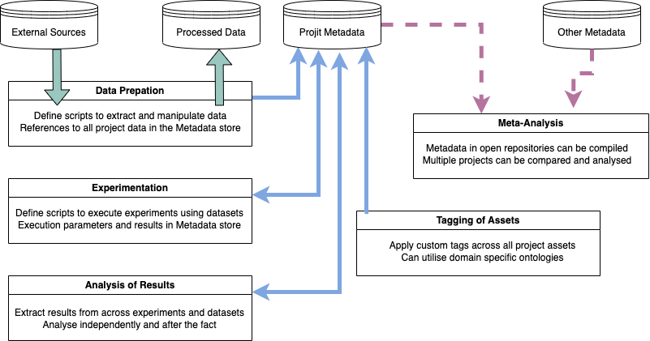

# Summary

Data science projects occupy an unsual space between fast scripting, software development,
and methodologically rigorous experimentation. They require careful discipline to 
prevent subtle problems like target leakage, over-fitting or p-hacking. At the same time
they cannot deliver results if they are locked down by rigid frameworks. Typically, 
data scientists use custom workflows, or proprietary cloud systems to automate and 
standardise certain elements like management of data sets, scripts, model artefacts 
and experimental results. The general absence of standardisation means that we cannot
easily migrate projects or audit them without significant investment in understanding
a codebase, nor can we easily repeat experiments or conduct meta-analysis across 
multiple projects. We present `projit` -- a simple open source package and CLI
for maintaining data science project meta-data and interoperability between stages
and processes.


# Statement of need

Software approaches to managing scientific data, processes and meta-data are 
typically either built as front-ends for specific 
scientific domains @[Howe2008,Pettit:2010] (leveraging known analytical practices in
the given domain) or they are designed to faciliate interoperability between different 
technology stacks @[Subramanian2013]. Machine learning focused frameworks tend to 
focus on solving problems of model training and deployment for specific technologies\cite@[Alberti:2018,MolnerDomenech:2020], and hence have limited generality.

`Projit` is a Python package for managing data science project meta-data
inside a simple local JSON store. It also provides a CLI tool for
interogating this data so that the current state of a project can easily
be assessed and understood. The API for `projit` was
designed so that it can be included in arbitrary python scripts to
locate datasets, register experiments and store results along
with hyper-parameters. 

The `projit` datastore is light-weight enough that it can easily be stored
with code inside a source code repository. Meaning that future users can
interogate the experiment history of the project. This is useful for both
project continuation, auditing/repeatability and opening the possibility
of scripted meta-data analysis. The package has been
used in a number of scientific publications to manage the results of 
machine learning experiments into systematic reviews for biomedical
projects [@Hawkins+Tivey:2024] and the analysis of text features derived 
from URLS [@Hawkins:2023]. In addition, `projit` has been used by the author
inside multiple industry based proprietary machine learning projects.

# Methodology

The core design principle of projit is that data science projects should 
be structured as loosely coupled components. Meaning, dependency is inevitable,
but it should be kept to an absolute minimum.
For example, experiments depend on a data processing
pipeline, but do not need to depend on anything but the output of that process.
Experiments should be able to be executed in parallel, so that they can be
re-run as required. They do not need to be aware of each other, but they should 
generate standardised result sets for comparison.

To facilitate loose coupling between stages of the project the `projit` utility
imposes a simple schema for components of a data science project. These consist
of:
- Datasets
- Experiments
- Results

All of these entities can be added, removed or modified using either the CLI tool
or the Python package within scripts. The relation of these components is depicted
in Figure \autoref{fig:projit}



In the development of `projit` we have drawn on additional design principles from
other open source projects. 

## Project Structure

There is an optional setting that allows users to determine a standard project structure.
This option will initialise any project with a predetermined set of directories and
files. We draw upon the principle used in the Cookie Cutter Data Science project when
implementing these project structures [@cookiecutter].

## Natural Language Sub Command CLI

In order to make the CLI interface easy to use we borrowed multiple ideas from the
design of the Git CLI [@git]. Firstly, any command will recursively search from the
current directory to discover the current project. This means users can run commands
from anywhere inside the project without tracking the location of the root directory.
Secondly, we develop a sub-command structure that allows the `'projit` CLI to be
a versatile tool with something close to a natural language interface.
For example, the primary command `list` can be applied to any of the `projit` 
entities, as shown in the code listing below:

```
projit list datasets
projit list experiments
projit list results
```

The same principle applies to the remove and add commands, which naturally require
additional paramaters to specifiy what is being added or removed. The design goal 
of the CLI is to make project intuitive without imposing arbitrary constraints.

# Research Applications

The fundamental research application of `projit` is in managing the project lifecycle
and efficiency of development. Results to all experiments can be tracked and interrogated
to easily produce tables of data. An additional level of application comes with a focus
on open science, allowing other teams to review and audit experiment history, then 
easily repeat or extend experiments. Finally, there is a research application in meta-analysis.
Projects in which the projit meta-data are stored along with open source code can 
be interoggated to look at the performance of certain techniques or algorithms across
multiple projects.  

# Acknowledgements

We acknowledge contributions from Jesse Wu and Priyabrata Karmakar 
in testing or reviewing the functionality and codebase of projit.

# References
