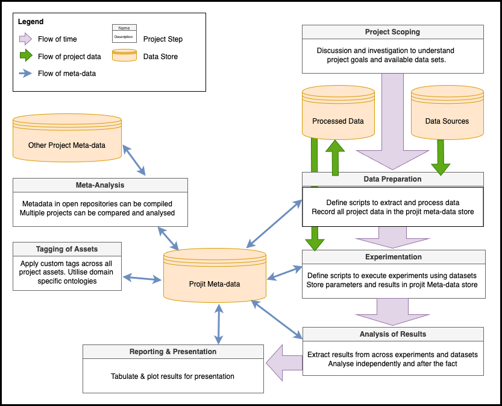

# Summary

Data science projects occupy an unsual space between rapid scripting, 
software development, and methodologically rigorous experimentation. 
They require careful discipline to 
prevent subtle problems like target leakage, over-fitting or p-hacking. 
At the same time
they cannot deliver results if they are locked down by rigid frameworks. Typically, 
data scientists use custom workflows, or proprietary cloud systems to automate and 
standardise certain elements like management of data sets, scripts, model artefacts 
and experimental results. The general absence of standardisation means that we cannot
easily migrate projects or audit them without significant investment in understanding
a codebase, nor can we easily repeat experiments or conduct meta-analysis across 
multiple projects. We present `projit` -- a simple open source package and CLI
for maintaining data science project meta-data and interoperability between stages
and processes. https://github.com/john-hawkins/projit


# Statement of need

Software approaches to managing scientific data, processes and meta-data are 
typically either built as front-ends for specific 
scientific domains [@Howe2008;@Pettit:2010] 
or they are designed to facilitate interoperability between different 
technology stacks [@Subramanian2013]. Machine learning project frameworks tend 
to solve problems of model training and deployment for specific 
technologies [@Alberti:2018;@MolnerDomenech:2020], and hence have limited 
application for general data science work.

`Projit` is a Python package for managing data science project meta-data
inside a simple local JSON store. It provides a CLI tool for
interrogating this data so that the project can easily
be assessed and understood. The API for `projit` was
designed so that the package can be included in python scripts to
locate datasets, register experiments and store results along
with hyper-parameters. 

The `projit` datastore is light-weight so it can be saved
with code inside a source code repository, allowing future users to
interrogate the experiment history of a project. This is useful for
project continuation, auditing/repeatability and opening the possibility
of scripted meta-data analysis. The authors have used the `projit` package
in multiple published research projects to manage the results of 
machine learning experiments into biomedical literature reviews
[@Hawkins+Tivey:2024] and the analysis of text features derived 
from URLS [@Hawkins:2023]. In addition, `projit` has been used by 
inside multiple commercial machine learning projects.

# Methodology

The core design principle of `projit` is that data science projects should 
be structured as loosely coupled components, with shared meta-data. 
Some dependency is inevitable, but it should be kept to an absolute minimum.
For example, experiments depend on a data processing
pipeline, but do not need to depend on anything but the output of that process.
Experiments should be able to be executed in parallel, so that they can be
re-run as required. They do not need to be aware of each other, but they should 
generate standardised result sets for comparison.

To facilitate loose coupling between stages of the project the `projit` utility
imposes a simple schema for components of a data science project. These consist
of:
* Datasets
* Experiments
* Results

All of these entities can be added, removed or modified using either the CLI tool
or the Python package within scripts. These entities in a project are depicted
in Figure \autoref{fig:projit}. On the right hand side of the figure you see the
common sequence of critical stages in standard data science (or data mining) 
workflow models like the CRISP-DM[@crisp]. 
Each of these stages depends on previous steps, but use of a meta-data
repository facilitates loose coupling between them. On the left hand side we depict
additional meta-analysis that can be performed across multiple meta-data stores.



In the development of `projit` we have drawn on additional design principles from
other open source projects, including the Git CLI [@git] and Cookie Cutter Data Science
[@cookiecutter], discussed in the sections below.

## Project Structure

Configuration allows users to determine a standard project structure.
This option will initialise any project with a predetermined set of directories and
files. We draw upon the principle used in the Cookie Cutter Data Science project when
implementing these project structures [@cookiecutter]. However, rather than be prescriptive
on project structure we allow it to be customised through configuration.

## Natural Language Sub Command CLI

In order to make the CLI interface easy to use we borrowed multiple ideas from the
design of the Git CLI [@git]. Firstly, any command will recursively search from the
current directory to discover the current project. This means users can run commands
from anywhere inside the project without tracking the location of the root directory.
Secondly, we develop a sub-command structure that allows the `projit` CLI to be
a versatile tool with something close to a natural language interface.
For example, the primary command `list` can be applied to any of the `projit` 
entities, as shown in the command below:

```
> projit list datasets
```

The same principle applies to the remove and add commands, which naturally require
additional parameters to specify what is being added or removed. The design goal 
of the CLI is to make `projit` intuitive without imposing arbitrary constraints.

# Research Applications

The fundamental research application of `projit` is in managing the project lifecycle
and efficiency of development. Paths to datasets are retrieved from meta-data, not
hard coded. Experiments are named, with execution times tracked. The Results to 
all experiments can be tracked over each iteration, with hyper-parameters and 
interrogated to easily produce tables of data and analysis.
Additional application comes with a focus
on open science, allowing other teams to review and audit experiment history, 
then easily repeat or extend experiments. 
Finally, there is a research application in meta-analysis.
Projects in which the `projit` meta-data are stored along with open source code can 
be analysed to look at the performance of certain techniques or algorithms across
multiple projects.  

# Acknowledgements

We acknowledge contributions from Jesse Wu and Priyabrata Karmakar 
in testing or reviewing the functionality and codebase of `projit`.

# References
